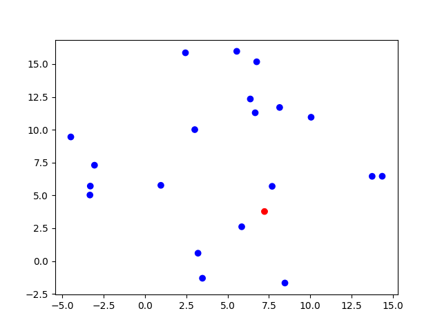

# GeometricMedian
[Geometric Median](https://en.wikipedia.org/wiki/Geometric_median#:~:text=In%20geometry%2C%20the%20geometric%20median,distances%20to%20the%20sample%20points.):
> In geometry, the geometric median of a discrete set of sample points in a Euclidean space is the point minimizing the sum of distances to the sample points.

It is simple to calculate 1D median, but no exact algorithm has been found to calculate median in `n` dimension space. This implementation uses simple gradient descent in pytorch to approximate geometric median.

## Simulation
